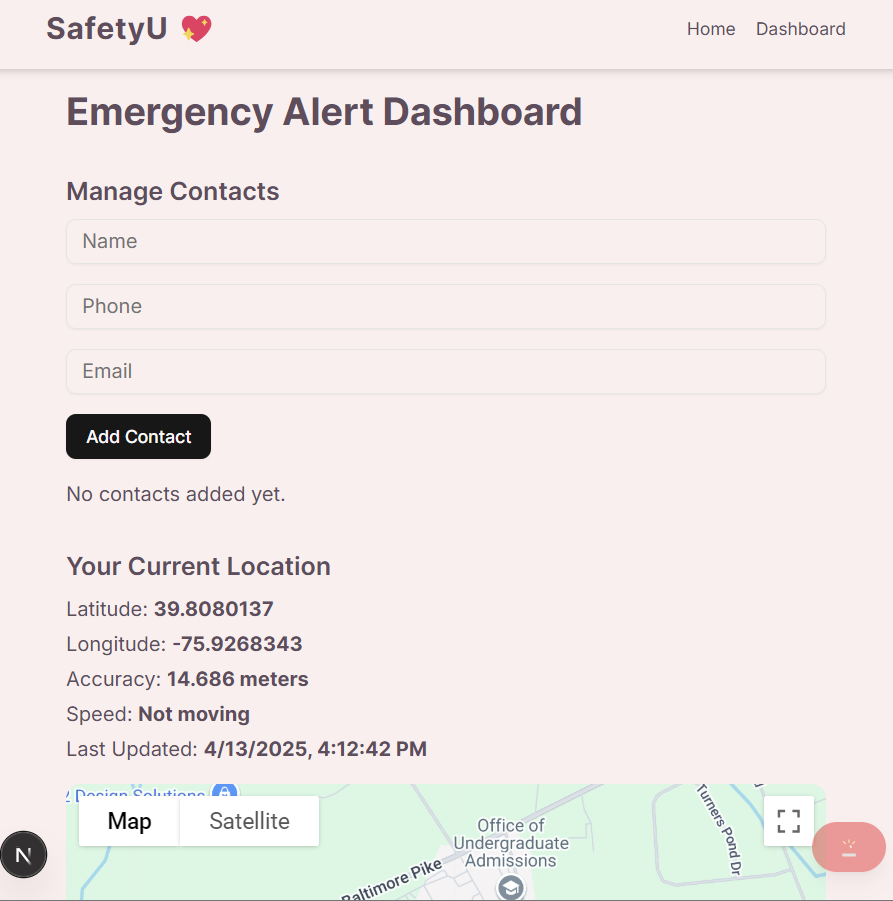
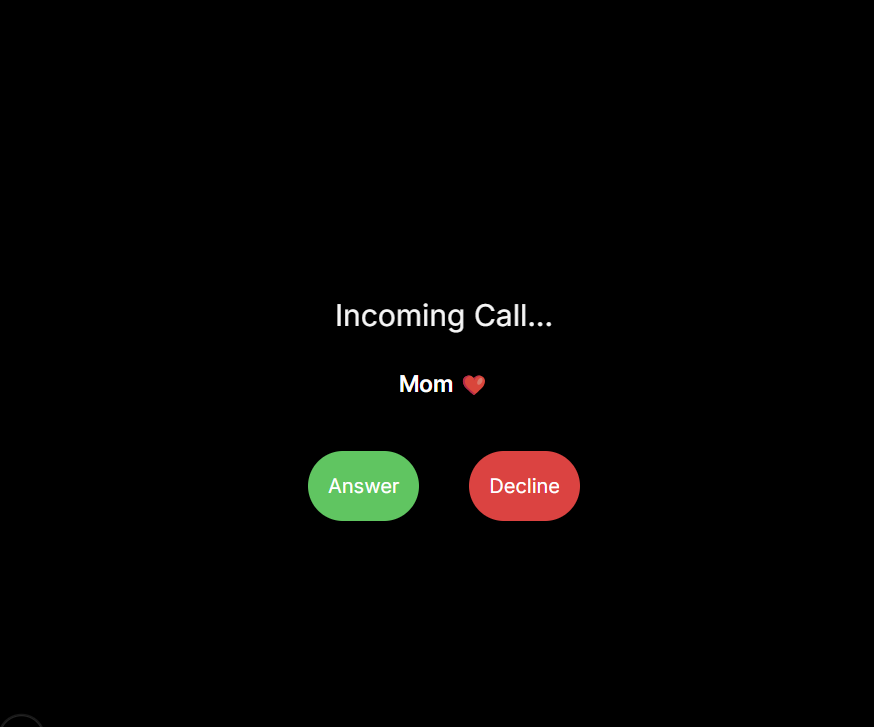
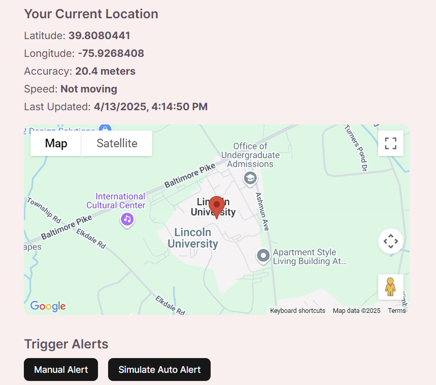

# Women Safety Web App 🚨

## Project Success Internship | Spring 2025  
*By Grace Julius - Lincoln University of Pennsylvania*

---

## Overview
This project was developed during my on-campus internship for Project Success. The goal of the Women Safety Web App is to provide female students with essential safety tools that are accessible, easy to use, and impactful during emergency situations.

This web application focuses on creating a safer environment using modern technology.

---

## Features

### 🔴 Emergency Panic Button
- Instantly triggers an alert
- Notifies trusted contacts
- Floating panic button for easy access

### 📍 Live Location Tracking
- Shows real-time user location
- Displays coordinates & accuracy
- Visual map powered by Google Maps API

### 👥 Manage Trusted Contacts
- Add / Edit / Delete emergency contacts
- Contacts stored using local storage

### 🚨 AI Threat Detection (Simulated)
- Randomized threat simulation
- Auto-alert trigger when threat detected

### ☎️ Fake Call Simulation
- Visual incoming call screen
- Helps escape uncomfortable situations
- Optional message after answering

### 💬 Motivational Quote Card
- Auto-updating real quotes every 10 seconds
- Fetches quotes online (with fallback quotes)
- Beautiful neon card design for user encouragement

### 📖 Safety Tips Page
- Simple guide with safety advice

### ✅ Check-In Safe Button
- Notifies contacts that you arrived safely

### 🌐 Safety Resources Page
- Useful links and emergency numbers

---

## Technologies Used
| Technology | Purpose |
|------------|---------|
| Next.js | Frontend Framework |
| Tailwind CSS | Styling & Responsive Design |
| EmailJS | Sending Email Alerts |
| Firebase (Config Ready) | For future backend integration |
| Geolocation API | Real-time Location Tracking |
| Axios | API Requests for Quotes |
| LocalStorage | Storing User Contacts |
| Google Maps API | Location Visualization |

---

## Screenshots

###  Dashboard View 
 

### Fake Call Simulation  

### Motivational Card 

 ### Location Tracking  

---

## Challenges Faced
- Building realistic safety features with limited backend resources
- Handling network errors gracefully
- Designing user-friendly and calm interfaces under pressure

---

## Key Takeaways
- Strengthened frontend development skills
- Gained experience in user-centered design
- Improved technical problem-solving abilities
- Passion for building technology for social good

---

## Future Improvements
- Real-time location sharing with backend storage
- Push notifications for alerts
- Authentication system with Firebase
- Integration with wearable devices
- Advanced AI threat detection using sensors

---

## Special Thanks
- Project Success Program - Lincoln University
- My Faculty mentor Dr. Tiffanie R. Smith

